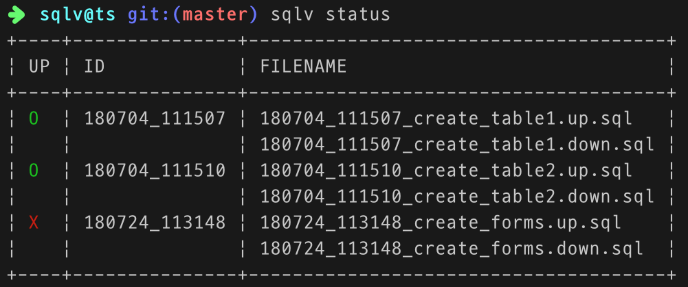

# SQLV

[](https://travis-ci.org/corgidisco/sqlv)
[](https://npmcharts.com/compare/sqlv?minimal=true)
[](https://www.npmjs.com/package/sqlv)
[](https://www.npmjs.com/package/sqlv)

[](https://david-dm.org/corgidisco/sqlv)
[](https://david-dm.org/corgidisco/sqlv?type=dev)

[](https://www.npmjs.com/package/sqlv)

Let SQL do what SQL can.

SQLV is very simple SQL Migrator.


## Installation

```bash
$ npm i sqlv -D
```

Change the package.json file to the following:

```json
{
  "scripts": {
    "sqlv": "sqlv"
  },
  ...
}
```

Now, Type the following to print the version.

```bash
$ npm run sqlv --version
```

To use it globally, please do the following:

```bash
$ npm i sqlv -g
```

## Usage

### Initialize Project

```bash
$ sqlv init .
$ sqlv init yourprojectpath
```

This will create a configuration file, `sqlv.config.js`.

You need to install additional packages(`mysql`, `mysql2`, `pg`, `sqlite3`) to match your database. SQLV is
based on the [@stdjs/database](https://www.npmjs.com/package/@stdjs/database).

example,

```bash
$ npm i mysql
$ npm i mysql2
$ npm i pg
$ npm i sqlite3
```

Now, edit `sqlv.config.js` file as follows:

```js
module.exports = {
  adapter: "mysql2",
  host: "localhost",
  database: "test",
  user: "root",
  password: "********",
}
```

### Create Migrations

```bash
$ sqlv create create_init_tables
```

Two files(`181201_000000_create_init_tables.up.sql`, `181201_000000_create_init_tables.down.sql`) are created under
the `./migrations` directory.

### Migrate

```bash
$ sqlv migrate
up 181201_000000 ... OK
```

### Show Current Status



```bash
$ sqlv status
```

### Rollback

```bash
$ sqlv rollback
down 181201_000000 ... OK
```

### Migrate Specific Version

```bash
$ sqlv up 181201_000000
up 181201_000000 ... OK
```

### Rollback Specific Version

```bash
$ sqlv down 181201_000000
down 181201_000000 ... OK
```

## Config

### Change Migration Directory

By default, the migration files are created in the `./migrations` directory. If you want to change this, please set up as follows:

```js
module.exports = {
  migrations: "otherdirectory", // default "migrations"
}
```

### Multi-Connection

If you have multiple DB connections, you can use:

```js
// sqlv.config.js
module.exports = {
  connections: {
    default: {
      adapter: "mysql",
      host: "localhost",
      database: "test",
      user: "root",
      password: "",
    },
    pg: {
      adapter: "pg",
      user: "root",
      password: "",     
    },
  },
}
```

Migrations files, you can specify a connection with a comment.

```sql
-- @sqlv connection: pg

CREATE /* ...SQL Syntax.... */;
```

You can specify multiple connections for one file.

```sql
-- @sqlv connection: default

CREATE /* ...SQL Syntax.... */;
CREATE /* ...SQL Syntax.... */;
CREATE /* ...SQL Syntax.... */;

-- @sqlv connection: pg

CREATE /* ...SQL Syntax.... */;
CREATE /* ...SQL Syntax.... */;
```

### Change History Manager

There are two history manager driver, `json` and `database`.

```js
module.exports = {
  history: {
    driver: "json",
  },
}
```

```js
module.exports = {
  history: {
    driver: "json",
    path: "./yourown.history.json"
  },
}
```

Migration information uses the `migrations` table in the database. If you want to change this, you can do the following:

```js
module.exports = {
  connections: {
    default: {
      ...
    },
    otherdatabase: {
      ...
    },
  },
  history: {
    driver: "database",
    connection: "otherdatabase",
    table: "yourownmigrationtable", // default "migrations"
  },
}
```

If you want to use multiple databases and set up a specific database, use:

## License

MIT
